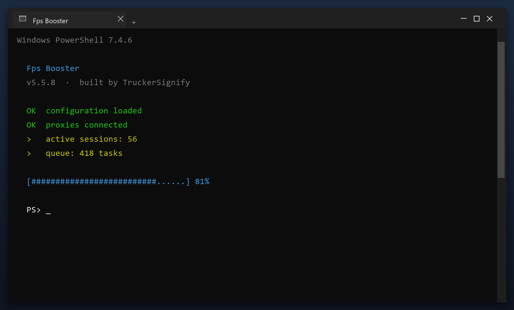

# Fps Booster: Free Download and Guide (2026)

 

**Fps booster** scans your PC and removes the junk that slows it down - temporary files, broken entries and leftover data. Everything stays on your own computer. **No telemetry, no cloud, no account.**

| | |
| --- | --- |
| **Program** | Fps Booster |
| **Version** | Latest 2026 build |
| **Price** | Free |
| **Systems** | see requirements below |
| **Download** | Quick Start section below |

  

## Before You Start

- Start with a quick scan before a deep scan
- Deep scans take longer but find more
- Check free space before and after
- Note any errors and check the FAQ
- Repeat monthly for consistent speed

## Requirements

| **Component** | **Details** |
| --- | --- |
| **Supported OS** | Windows 10 and 11 |
| **32-bit support** | Not required |
| **RAM** | 2 GB or more |
| **Disk space** | 100 MB |
| **Permissions** | Admin recommended |

## Install

1. **Download** the tool with the button below
2. **Extract** the archive (WinRAR or 7-Zip)
3. **Run** the program as administrator
4. **Scan** - wait for the scan to finish
5. **Fix** - review the results and press the repair button

  

> **Note:** this tool changes system settings, so antivirus software may be cautious. Add an exclusion if needed - the build on this page is tested.

## What It Does

Think of fps booster as a housekeeper for your computer. Over time, files pile up that nobody uses - installers you ran once, caches, old logs. The tool finds those piles and clears them, which frees space and often speeds the PC up.

| **Term** | **Meaning** |
| --- | --- |
| **Cache** | Saved data that can be rebuilt |
| **Leftover** | A file an uninstall forgot |
| **Duplicate** | The same file stored twice |
| **Free space** | Room available on your drive |

## Features

| **Feature** | **Details** |
| --- | --- |
| **Supported systems** | Windows 10 and 11 |
| **Scheduling** | Optional automatic scans |
| **Undo** | Restore point created first |
| **Interface** | Simple, plain English |
| **Safety** | Scanned and tested build |
| **Version** | Current 2026 release |

## Problems and Fixes

| **Issue** | **Fix** |
| --- | --- |
| **High CPU during scan** | Expected - it throttles when you use the PC |
| **Antivirus blocks cleanup** | Add an exclusion for the tool |
| **Cleanup leaves temp files** | Some are locked - reboot and rescan |
| **Tool asks for admin** | Approve it so it can clean system areas |

## FAQ

**Is fps booster free?**

Yes - the full version, no registration and no hidden payments.

**Is it safe?**

The build is scanned and tested. It creates a restore point before making changes.

**Does it work on Windows 11?**

Yes, and on Windows 10 (64-bit).

**Will it delete my files?**

No. It only removes temporary and leftover files, not your documents or photos.

**Do I need the internet?**

Only to download it. After that it works offline.

**Where do I download it?**

Use the green button in the Quick Start section above.

---

*elegant-eagle-858 · Updated 2026-10-09 · Shared under the MIT License*
